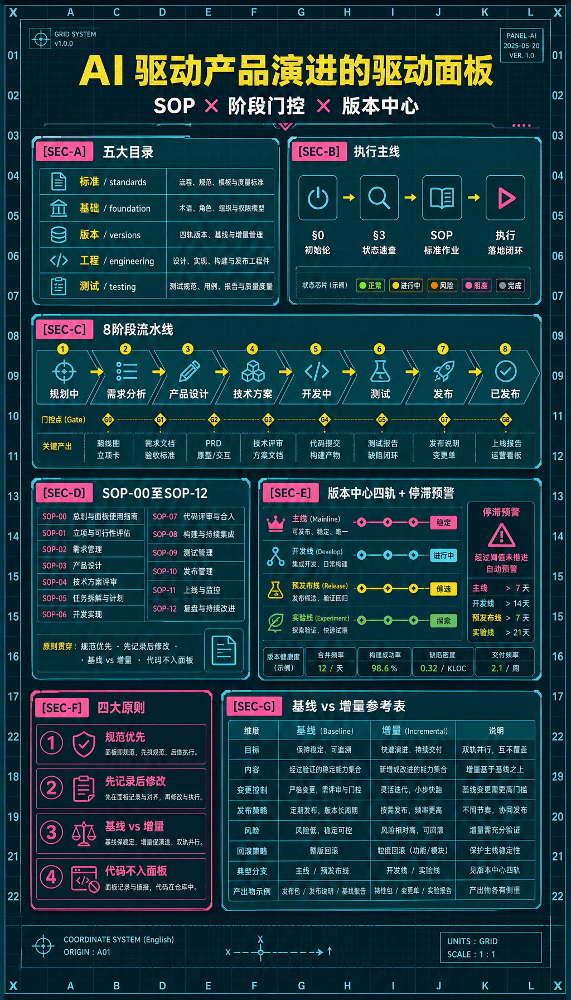

# nick

> AI 驱动产品演进的唯一驱动面板。所有产品方案、技术方案、测试方案、规范文档均在此管理。



---

## 🚀 初次使用？从这里开始

| 你的情况 | 操作 |
|---------|------|
| 全新产品，从 0 开始规划和设计 | 阅读 [SETUP.md](./SETUP.md) → 路径一：新产品初始化 |
| 已有产品，将其迁移至本架构 | 阅读 [SETUP.md](./SETUP.md) → 路径二：已有产品迁移 |
| 初始化已完成，日常工作 | 阅读 `AGENTS.md`，从 §3 状态速查开始 |

---

## 这是什么

**nick**（nickbody.com）是一款 macOS 桌面健康应用：一只住在屏幕边缘的电子宠物记录你的屏幕疲劳，在你连续工作超时后邀请你做一套 3 分钟头颈部微运动，用摄像头端侧姿态识别对动作实时评分——运动质量转化为宠物的健康分与段位成长（Bronze → Legend），把"保护脖子"变成"把宠物越养越好"。核心设计原则：软惩罚（分数衰减但段位永不降）、绝不锁屏强制、摄像头画面 100% 端侧处理不落盘不上传。英文卖点：*Your desk pet that keeps your neck alive.*

## 如何使用（AI Agent）

直接阅读 `AGENTS.md`，其中包含完整的项目背景、导航路径和操作规约。

## 目录导航

| 目录 | 用途 |
|------|------|
| `standards/` | 产品级规范（设计/研发/测试/运维，优先于公司级） |
| `foundation/` | 项目基础文档（市场调研/商业模式/产品架构/技术架构） |
| `versions/` | 版本中心，当前版本见 `versions/CURRENT.md` |
| `engineering/` | 研发工程引导 + 环境文档 + API 文档 |
| `testing/` | 测试工程引导 + 测试策略文档 |

## 快速定位当前工作

```
versions/CURRENT.md        ← 当前版本和阶段
versions/{ver}/README.md   ← 版本进度明细
versions/{ver}/CHANGES.md  ← 最新变更记录
```

---

## 💬 常见场景——复制提示词给 AI

> 找到你当前所在的阶段，把提示词复制粘贴给 AI，它会自动找到对应流程执行。
> 方括号 `[...]` 中的内容替换为你的实际信息。

---

### 📦 第一次使用

**全新产品，从 0 开始**

```
我刚 clone 了这个面板，打算做一个全新产品，帮我开始初始化。
```

**已有产品，想迁移进来统一管理**

```
我们有一个已上线的产品，想把它迁移到这个面板统一管理，帮我开始。
```

---

### 📋 需求管理

**有一个新想法，还没决定要不要做**

```
我有一个新需求想法，先帮我记录到需求池：[描述需求]，暂时不纳入任何版本。
```

**需求确认要做了，展开详细文档**

```
[需求名] 确认要做，纳入 v1.0.0，帮我展开详细需求文档。
```

**需求在开发途中要改**

```
v1.0.0 的 [某功能] 需求要改一下：[描述变更内容]。
```

---

### 🎨 产品设计

**需求已确认，写产品设计文档**

```
v1.0.0 的需求已经全部确认，帮我写产品设计文档。
```

**设计文档写完，更新到统一原型**

```
v1.0.0 的产品设计文档写完了，帮我把新增页面更新到统一原型工程里。
```

---

### 🔧 技术方案

**开始写技术方案**

```
帮我为 v1.0.0 写技术方案。
```

**本版本需要引入新的技术或中间件**

```
v1.0.0 技术方案里需要引入 [技术/中间件名称]，帮我更新方案和依赖记录。
```

---

### 💻 开发阶段

**开始开发某个功能**

```
帮我开发 v1.0.0 的 [某功能]。
```

**开发过程中发现了 bug（测试环境）**

```
测试环境发现了一个 bug：[描述问题]，帮我记录一下。
```

---

### 🧪 测试阶段

**开始编写测试用例**

```
帮我为 v1.0.0 的 [某功能] 编写测试用例。
```

**测试发现了一个 bug**

```
测试发现了一个 [P0/P1/P2] 级 bug：[描述问题]，帮我记录。
```

**测试过程中需求又改了**

```
测试过程中，[某功能] 需要调整：[描述变更]，帮我处理这个变更。
```

**测试工作完成，写测试报告**

```
v1.0.0 测试工作已经完成，帮我写测试报告。
```

---

### 🚀 发布 & 上线

**测试通过，推进到发布阶段**

```
v1.0.0 测试通过，帮我推进到发布阶段。
```

**生产环境发现紧急 bug，需要热修复**

```
v1.0.0 生产环境发现了紧急 bug：[描述问题]，需要立即热修复。
```

**生产环境发现非紧急 bug，先记录**

```
v1.0.0 线上发现了一个 bug：[描述问题]，不紧急，帮我先记录下来。
```

---

### 🔄 版本管理

**当前版本发布完成，开始下一个版本**

```
v1.0.0 已经正式发布上线了，帮我开始准备 v1.1.0。
```

**想看看当前项目的整体进展**

```
帮我看一下当前项目状态，进展到哪里了。
```

**不确定某个内容应该放在哪个文档**

```
我不太确定 [内容描述] 应该记录在哪个文件里，帮我确认一下。
```


## Community

- Thanks to the [LinuxDO](https://linux.do) community for their support
