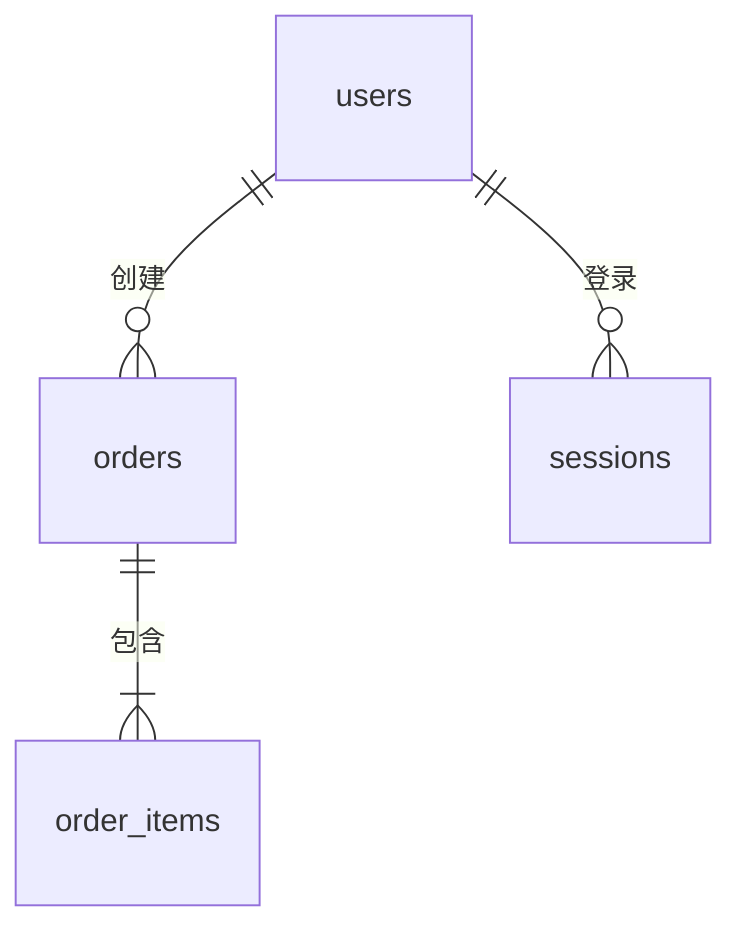

# 产品全量数据表结构

> 本文档反映**当前生效**的完整数据库表结构（基线，跨版本长期维护）。
> 版本内增量见 `versions/{ver}/engineering/db-design.md`。
> 填充与维护规则见 [README.md](./README.md)。
>
> **最后同步的版本**：<!-- v1.0.0 / 初始迁移 / 迁移前 -->
> **最后更新日期**：<!-- YYYY-MM-DD -->

---

## 规范约定

> 本规范与 `versions/{ver}/engineering/db-design.md` 的「规范约定」保持一致。

| 约定项 | 规范 |
|--------|------|
| 表命名 | 小写 snake_case，复数形式（如 `users`、`verification_codes`）|
| 字段命名 | 小写 snake_case（如 `created_at`、`phone_number`）|
| 主键 | `id BIGINT UNSIGNED AUTO_INCREMENT` |
| 标准时间字段 | `created_at DATETIME(3)`、`updated_at DATETIME(3)` 所有表必须包含 |
| 软删除 | 支持软删除的表增加 `deleted_at DATETIME(3) NULL` |
| 字符集 | `utf8mb4` / 排序规则 `utf8mb4_unicode_ci` / 存储引擎 `InnoDB` |
| 金额字段 | 使用 `BIGINT`，存储最小货币单位（分） |
| 枚举字段 | 使用 `VARCHAR`，不使用 `ENUM` 类型 |
| 索引命名 | 唯一索引：`uk_{表名缩写}_{字段名}`；普通索引：`idx_{表名缩写}_{字段名}` |
| 外键约束 | **不使用数据库外键**，关联关系通过应用层代码保证 |
| API/DB 命名映射 | DB 层 snake_case（`created_at`），API 层 lowerCamelCase（`createTime`） |

---

## 实体关系总览（ERD）

<!-- 复杂产品建议在此放一份 Mermaid ERD；简单产品可删除本节



> ER 图展示逻辑关联，非物理外键约束。
-->

---

## 模块：<!-- 如：用户中心 -->

<!-- 每个业务模块一节。模块划分应与 foundation/product-arch/overview.md 的模块详情对齐。 -->

### `{表名}`

**用途**：<!-- 这张表存什么数据，支撑什么业务场景 -->

**字段**：

| 字段名 | 类型 | 可为空 | 默认值 | 说明 |
|--------|------|--------|--------|------|
| id | BIGINT UNSIGNED | 否 | AUTO_INCREMENT | 主键 |
| <!-- 字段名 --> | <!-- 类型 --> | 否/是 | <!-- --> | <!-- 说明 --> |
| created_at | DATETIME(3) | 否 | CURRENT_TIMESTAMP(3) | 创建时间 |
| updated_at | DATETIME(3) | 否 | CURRENT_TIMESTAMP(3) ON UPDATE CURRENT_TIMESTAMP(3) | 更新时间 |

**索引**：

| 索引名 | 类型 | 字段 | 用途 |
|--------|------|------|------|
| <!-- uk_xxx_yyy --> | UNIQUE | <!-- 字段名 --> | <!-- 用途 --> |

**状态机**（如有 status 字段）：

| 当前状态 | 转换条件 | 目标状态 | 说明 |
|---------|---------|---------|------|
| <!-- --> | <!-- --> | <!-- --> | <!-- --> |

**完整 DDL**：
```sql
CREATE TABLE `{表名}` (
  `id` BIGINT UNSIGNED NOT NULL AUTO_INCREMENT COMMENT '主键',
  -- 其他字段
  `created_at` DATETIME(3) NOT NULL DEFAULT CURRENT_TIMESTAMP(3) COMMENT '创建时间',
  `updated_at` DATETIME(3) NOT NULL DEFAULT CURRENT_TIMESTAMP(3) ON UPDATE CURRENT_TIMESTAMP(3) COMMENT '更新时间',
  PRIMARY KEY (`id`)
) ENGINE=InnoDB DEFAULT CHARSET=utf8mb4 COLLATE=utf8mb4_unicode_ci COMMENT='<!-- 表注释 -->';
```

---

## 模块：<!-- 如：订单中心 -->

<!-- 重复上述结构 -->

---

## 变更历史

> 重大结构变更在此简要记录，详细变更见对应版本的 `versions/{ver}/engineering/db-design.md`。

| 日期 | 版本 | 变更摘要 |
|------|------|---------|
| <!-- YYYY-MM-DD --> | <!-- v1.0.0 --> | <!-- 初版迁移 / 新增 XX 表 / 修改 YY 字段 --> |
