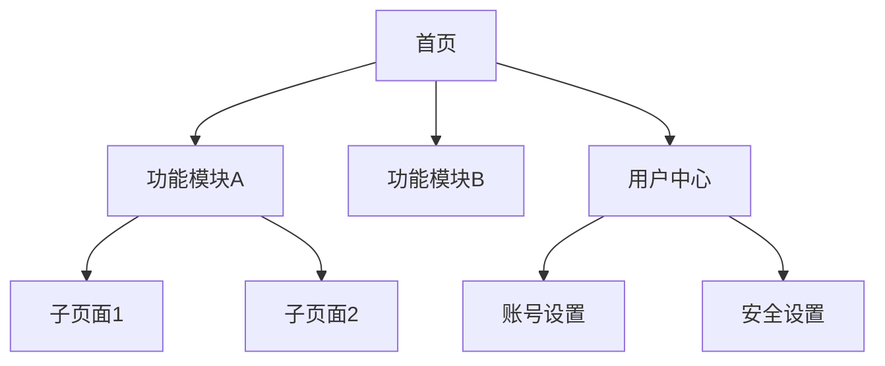
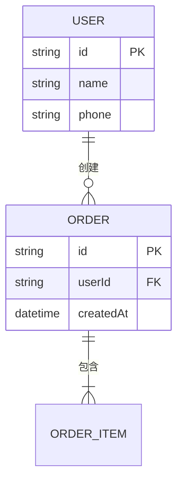

# 信息架构（IA）

> 本文档定义产品的信息组织方式和导航结构
> 产品全貌见 [overview.md](./overview.md)
> 视觉和交互细节见 [../../standards/design/DESIGN.md](../../standards/design/DESIGN.md)
> 最后更新：<!-- YYYY-MM-DD -->

---

## 导航结构

<!-- 描述产品的页面/功能层级关系

### 层级说明

| 层级 | 说明 | 示例 |
|------|------|------|
| 一级 | 主导航入口 | 首页、工作台、设置 |
| 二级 | 功能模块页面 | 考勤管理、排班管理 |
| 三级 | 详情/操作页面 | 考勤详情、排班编辑 |
-->

---

## 核心实体关系

<!-- 产品中的主要数据实体及其关联关系

> 注：此处为逻辑关系图，非数据库外键约束（外键由应用层保证）
-->

---

## 权限模型

<!-- 描述用户角色与可访问资源的对应关系

### 角色定义

| 角色 | 说明 | 适用场景 |
|------|------|---------|
| <!-- 如：普通用户 --> | <!-- --> | <!-- --> |
| <!-- 如：管理员 --> | <!-- --> | <!-- --> |

### 权限矩阵

> 只列出有角色差异的权限项，全角色一致的权限无需列出

| 功能/资源 | 普通用户 | 管理员 | 超级管理员 |
|---------|---------|--------|----------|
| <!-- 查看自己的数据 --> | ✅ | ✅ | ✅ |
| <!-- 管理他人数据 --> | ❌ | ✅ | ✅ |
| <!-- 系统配置 --> | ❌ | ❌ | ✅ |
-->

---

## 数据流向

<!-- 核心业务场景下数据在系统中的流转路径

### {场景名称}

**数据来源**：<!-- 用户输入 / 外部系统 / 内部计算 -->
**处理过程**：<!-- 关键的数据转换和业务规则 -->
**存储位置**：<!-- 数据库表/缓存/文件 -->
**消费方**：<!-- 哪些页面/角色/外部系统使用此数据 -->
-->

---

## 搜索与过滤规范

<!-- 产品中搜索和过滤功能的统一规范（如有）

| 场景 | 支持的搜索/过滤字段 | 实时搜索 | 默认排序 |
|------|-----------------|---------|---------|
| <!-- 用户列表 --> | <!-- 姓名、手机号 --> | 是/否 | <!-- 创建时间倒序 --> |

无搜索功能则填「本产品暂无搜索功能」
-->

---

## 说明

- 本文档关注信息的组织方式，权限矩阵是产品层定义，技术实现见 versions/{ver}/engineering/tech-solution.md
- 导航结构变更时同步更新本文档
- 本文档变更通过 changelog.md 追踪 → 见 [changelog.md](./changelog.md)
