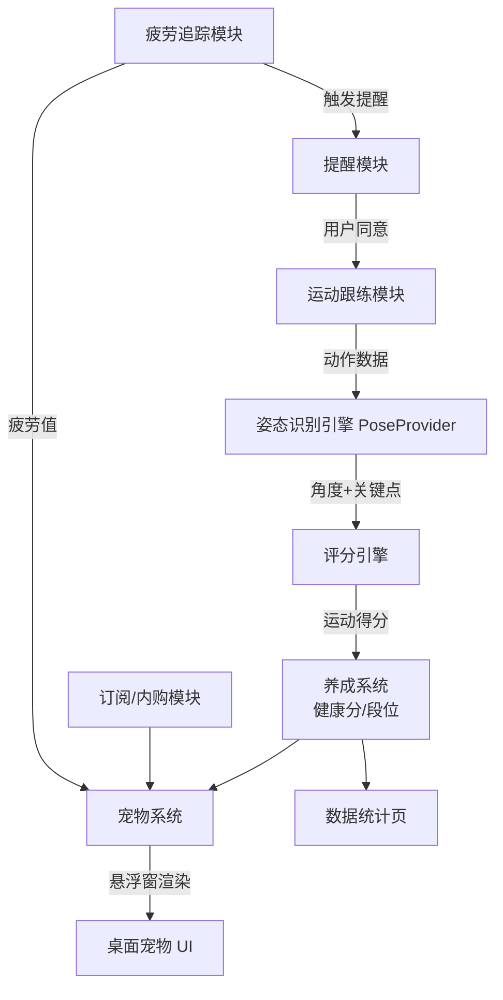
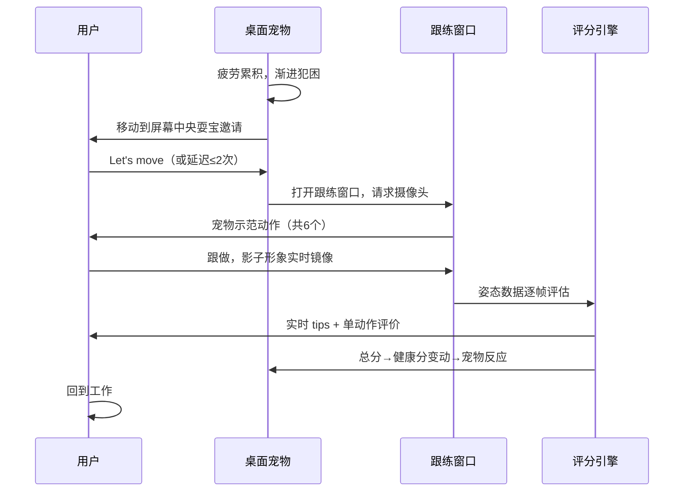

# 产品全貌

> 本文档描述产品当前的完整功能架构，代表最新全貌
> **「模块详情」表是全量已上线功能的权威清单（基线，快照视角）**
> 随版本迭代持续更新，变更记录见 [changelog.md](./changelog.md)
> 信息架构（IA）详见 [information-arch.md](./information-arch.md)
> 商业模式与价值主张见 [../business/business-model.md](../business/business-model.md)
> 技术架构见 [../tech-arch/overview.md](../tech-arch/overview.md)
> 用户研究见 [../market/user-research.md](../market/user-research.md)
> 最后更新：2026-07-14
> ⚠️ 产品尚未上线，本文档当前为「产品愿景架构」（V1 规划视角），发布后转为已上线基线。

---

## 产品定位

nick（nickbody.com）是一款 macOS 桌面健康应用：桌面电子宠物记录用户屏幕疲劳，超时后邀请用户做 3 分钟头颈部微运动，用摄像头端侧姿态识别实时评分，运动质量转化为宠物健康分与段位成长——把"保护脖子"变成"把宠物越养越好"。

---

## 功能模块体系

### 模块全景

### 模块详情

| 模块名称 | 职责说明 | 核心功能点 | 依赖模块 | 引入版本 |
|---------|---------|----------|---------|---------|
| 疲劳追踪 | 统计连续设备使用时长 | 三档预设（30/60/90min）、键鼠活动检测（离开 5min 暂停计时）| 无 | v1.0.0 |
| 提醒模块 | 疲劳超时后触发宠物邀请 | 宠物耍宝邀请、Let's move / 延迟（每轮≤2 次）、绝不锁屏 | 疲劳追踪、宠物系统 | v1.0.0 |
| 姿态识别引擎 | 摄像头帧→头部角度+肩部关键点 | PoseProvider 协议抽象；Vision framework 实现；纯内存处理 | 无 | v1.0.0 |
| 运动跟练 | 宠物领操+影子镜像跟练流程 | 头颈肩操 6 动作、影子形象（不显示真实画面）、实时 tips、无摄像头降级模式 | 姿态识别、宠物系统 | v1.0.0 |
| 评分引擎 | 动作完成度计算 | 幅度/保持/节奏三维、宽容带判定、单动作评价+总分汇总 | 姿态识别 | v1.0.0 |
| 养成系统 | 健康分与段位管理 | 0–1000 健康分、6 段位（V1 实装前 3）、软惩罚衰减（段位永不降）、归来加成 | 评分引擎 | v1.0.0 |
| 桌面宠物 UI | 宠物的一切视觉呈现 | 透明悬浮窗、可拖动/半隐藏、闲时逗趣动作、疲劳可视化（渐进犯困）、Rive 状态机 | 养成系统、疲劳追踪 | v1.0.0 |
| 数据统计 | 运动历史与成长记录 | 段位页、周视图、连续天数 | 养成系统 | v1.0.0 |
| 订阅/内购 | 商业化 | StoreKit 2 订阅、免费/付费权益控制 | 无 | v1.0.0 |
| 形象分类货架 | 多宠物选择与解锁 | 动物/植物精灵/原创物种分类、付费形象（更多表情/特效）| 订阅、桌面宠物 UI | v2 规划 |
| 智能疲劳值 | 动态疲劳计算 | 时段权重、运动质量反馈 | 疲劳追踪 | v2 规划 |

> **职责边界原则**：评分引擎只消费 PoseProvider 输出的「角度+关键点」，不感知底层模型——为跨平台换模型（MediaPipe）预留边界。

---

## 用户角色与权限体系

| 角色 | 描述 | 可访问模块 | 特殊权限 |
|------|------|----------|---------|
| 免费用户 | 默认角色 | 全部核心循环模块、1 只宠物、前 3 段位 | — |
| nick+ 订阅用户 | 付费订阅 | 全部 + 形象分类、高段位特效、扩展运动库、周报 | — |

> 单机产品，无管理员/多租户概念。

---

## 核心用户旅程

### 旅程一：疲劳-运动-成长循环（核心循环）

**用户角色**：任意用户
**触发条件**：连续设备使用达到所选档位阈值

**关键决策点**：提醒时点（打断心流则拒绝率高）；摄像头授权（拒绝则降级纯跟练）
**成功完成标志**：完成 6 个动作并看到健康分变动与宠物反馈

### 旅程二：首次启动 Onboarding

**用户角色**：新用户
**触发条件**：首次启动
流程：欢迎 → 选宠物（V1 单只，命名）→ 选疲劳档位（默认 Standard 60min）→ 演示一次跟练（可跳过摄像头）→ 宠物入驻桌面
**成功完成标志**：宠物出现在桌面 + 完成或预约第一次跟练

---

## 核心业务流程

### 流程一：疲劳计时与提醒触发

**触发条件**：应用常驻后台运行
**参与模块**：疲劳追踪、提醒模块、宠物 UI
**流程步骤**：
1. 疲劳追踪监听键鼠活动事件（仅时间戳，不记录内容），持续无操作 5 分钟暂停计时
2. 达到档位阈值 → 通知提醒模块
3. 提醒模块检查免打扰条件（全屏演示模式等）→ 指示宠物 UI 播放邀请动画
4. 用户响应：同意 → 启动跟练流程；延迟 → 计时 +5min（每轮≤2 次）；忽略 → 健康分进入衰减

**异常处理**：系统摄像头被占用/无摄像头 → 自动降级纯跟练模式（基础分）

---

## 系统边界

### 产品边界

**包含**：疲劳追踪、提醒、头颈肩运动跟练与评分、宠物养成、本地数据统计、订阅

**不包含（明确排除）**：
- 工作监控/生产力统计（红线：绝不做老板监控观感的功能）
- 医疗诊断与治疗宣称（合规红线）
- 心理健康功能（Finch 赛道，不进入）
- 社交/排行榜（V1 排除，远期评估）
- 账号系统与云同步（V1 无后端）

### 外部集成

| 外部系统 | 集成方式 | 数据流向 | 集成版本 | 状态 |
|---------|---------|---------|---------|------|
| Mac App Store / StoreKit 2 | 系统框架 | 订阅状态（本地验证）| v1.0.0 | 规划中 |
| Apple Vision framework | 系统框架 | 摄像头帧→端侧推理（不出本机）| v1.0.0 | 规划中 |
| Rive Runtime | 内嵌库 | 宠物动画渲染 | v1.0.0 | 规划中 |

---

## 产品演进路线（Roadmap 概览）

| 时间范围 | 方向 | 说明 |
|---------|------|------|
| 近期（v1.0.0）| 核心循环闭环 | 单宠物、头颈操、评分、前 3 段位、订阅上架 |
| 中期（3-6个月）| 内容与段位扩展 | 形象分类货架、后 3 段位、更多运动操、智能疲劳值 |
| 长期（6个月+）| 平台扩展 | Windows（MediaPipe）、移动伴侣 App、IP 联名 |

---

## 说明

- 本文档代表产品当前全貌，不记录历史状态
- 每次版本迭代新增功能模块后，同步更新「模块详情」表和「模块全景」图
- 发生重大架构调整时，在 changelog.md 中追加变更记录
- AI 在进行产品相关工作前，应先读取本文档了解产品全貌
