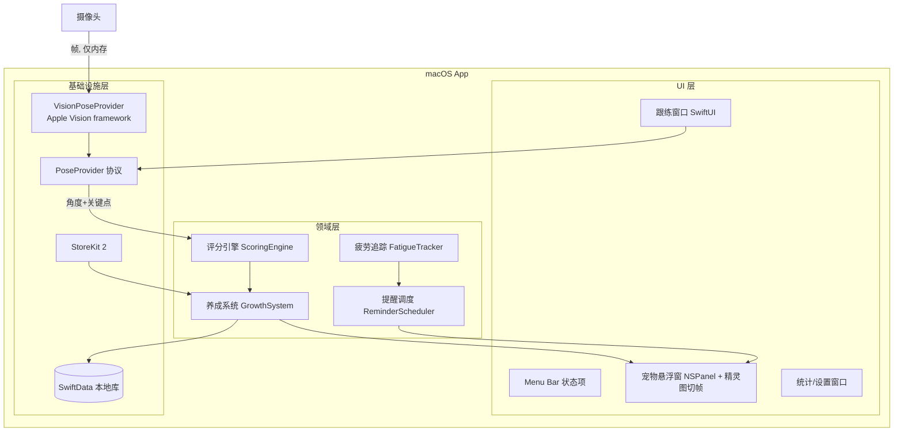

# 技术架构全貌

> 本文档描述产品当前的完整技术架构，代表最新全貌
> 随版本迭代持续更新，变更记录见 [changelog.md](./changelog.md)
> 技术决策记录（ADR）见 [decisions/](./decisions/)
> 产品架构见 [../product-arch/overview.md](../product-arch/overview.md)
> 研发工程文档见 [../../engineering/README.md](../../engineering/README.md)
> 最后更新：2026-07-16

---

## 架构概述

**纯端侧单机架构，V1 零后端。** macOS 原生应用（Swift + SwiftUI），menu bar 常驻 + 透明悬浮窗承载宠物；摄像头姿态识别使用系统内置 Apple Vision framework（100% 端侧，帧仅内存处理不落盘不上传）；宠物动画由原生 SwiftUI 精灵图集（8×11 Spritesheet）切帧状态机驱动，零第三方动画运行时；数据 SwiftData 本地存储；订阅走 StoreKit 2 本地验证。核心工程原则：姿态识别以 `PoseProvider` 协议抽象，评分引擎只消费「角度+关键点」，为未来跨平台换模型（MediaPipe）预留边界。

---

## 技术栈总览

| 层次 | 技术选型 | 版本 | 选型说明 |
|------|---------|------|---------|
| 客户端框架 | Swift + SwiftUI | Swift 5.x / 最低 macOS 14 | 原生性能与悬浮窗形态必需；最低版本随 M1 验证定档 |
| 应用形态 | menu bar app（LSUIElement）+ NSPanel 透明无边框悬浮窗 | — | 桌面宠物常驻形态 |
| 姿态识别 | Apple Vision framework（主选）| 系统内置 | FaceObservation yaw/pitch/roll 直接对应转头/点头/歪头；VNDetectHumanBodyPoseRequest 肩部关键点；自动调度神经引擎，功耗最低；详见 ADR-001 |
| 姿态识别备选 | RTMPose/MoveNet 转 CoreML | Apache 2.0 | M1 bake-off 不达标时启用；V2 跨平台用 MediaPipe |
| 宠物渲染 | 原生 SwiftUI 精灵图集切帧（8×11 Spritesheet，透明 WebP）| 系统内置 | 视口裁剪切帧+状态机，零三方运行时，消除常驻发热；单帧 192×208；详见 ADR-002 |
| 数据库 | SwiftData（本地）| 系统内置 | V1 无账号无云同步 |
| 缓存 | 无 | — | 单机无需 |
| 消息队列 | 无 | — | 单机无需 |
| 对象存储 | 不使用 | — | V1 无文件上传需求 |
| 支付 | StoreKit 2 | 系统内置 | 订阅无需自建服务器 |
| CI/CD | Xcode Cloud 或 GitHub Actions（待定）| — | 送审自动化，M4 阶段定 |
| 崩溃/分析 | Apple 自带（App Store Connect）| — | V1 不引入三方 SDK，隐私叙事一致性 |

> 明确排除：YOLO 系（AGPL-3.0 闭源商用不可行）、OpenPose（非商用许可）、Electron/跨平台框架（悬浮窗/功耗短板）。

---

## 系统架构图

---

## 模块划分

| 服务/模块 | 职责 | 技术栈 | 对应工程仓库 |
|---------|------|--------|-----------|
| macos-app | 全部产品功能（单工程）| Swift/SwiftUI + Vision + 精灵图渲染 + SwiftData + StoreKit 2 | [nickbody-macos](https://github.com/zt994451054/nickbody-macos) |
| 官网 | 落地页 + 隐私说明 + MAS 导流 | 静态站（待定，如 Astro）| 待创建 |

---

## 可观测性设计

| 维度 | 方案 | 说明 |
|------|------|------|
| 日志 | os.Logger 本地日志 | 不上传；敏感数据（摄像头相关）永不入日志 |
| 指标 | App Store Connect 自带分析 | 下载/订阅/崩溃 |
| 链路追踪 | 暂未引入 | 单机应用不适用 |
| 告警 | 暂未引入 | — |

---

## 部署架构

### 环境划分

| 环境 | 说明 | 部署方式 |
|------|------|---------|
| dev | 本地开发 | Xcode 本地运行 |
| staging | 内测/公测 | TestFlight |
| prod | 生产 | Mac App Store |

### 高可用设计

单机应用不适用。关键健壮性要求：摄像头被占用/缺失时自动降级纯跟练模式；悬浮窗常驻的内存/功耗预算（后台 CPU <1%，跟练中合理占用）。

---

## 安全架构

| 安全层面 | 方案 | 说明 |
|---------|------|------|
| 认证 | 无账号体系 | V1 单机 |
| 摄像头隐私 | 帧仅内存处理，不落盘、不上传、不入日志 | 产品第一卖点，架构级保证 |
| 权限申请 | 摄像头权限仅在用户同意跟练时请求 | 含用途说明文案 |
| 传输安全 | 无网络传输（除 StoreKit/官网）| — |
| 数据加密 | SwiftData 本地容器（系统沙盒保护）| 无敏感个人信息 |
| 数据合规 | GDPR/CCPA 天然合规（数据不出设备）| App Store 隐私标签如实申报 |
| 依赖安全 | 零第三方运行时依赖（全部使用系统框架）| 最小依赖面 |

---

## 关键技术决策索引

> 详细决策过程见 [decisions/](./decisions/) 目录下的 ADR 文件

| 决策编号 | 决策主题 | 状态 | 引入版本 |
|---------|---------|------|---------|
| [ADR-001](./decisions/ADR-001-pose-estimation.md) | 姿态识别选型：Apple Vision framework vs 开源模型 | 已接受 | v1.0.0 |
| [ADR-002](./decisions/ADR-002-sprite-animation-replace-rive.md) | 宠物动画渲染选型：原生精灵图集切帧替代 Rive Runtime | 已接受 | v1.0.0 |

---

## 性能基线

| 指标 | 当前值 | 测试条件 | 测试版本 |
|------|--------|---------|---------|
| 跟练时姿态推理帧率 | 待 M1 实测（目标 ≥15fps）| MacBook Air M1 基线机型 | v1.0.0 |
| 后台常驻 CPU 占用 | 待实测（目标 <1%）| 宠物闲时动画 | v1.0.0 |
| Vision 肩部关键点稳定性 | 待 M1 bake-off | 坐姿近距（0.5–1m）| v1.0.0 |

---

## 说明

- 本文档代表技术架构当前全貌，不记录历史状态
- 每次版本迭代涉及架构调整时，同步更新本文档并在 changelog.md 追加记录
- 重大技术决策须在 decisions/ 目录下创建对应 ADR 文件
- AI 在做技术方案设计前，应先读取本文档了解技术架构基线
→ 变更记录见 [changelog.md](./changelog.md)
