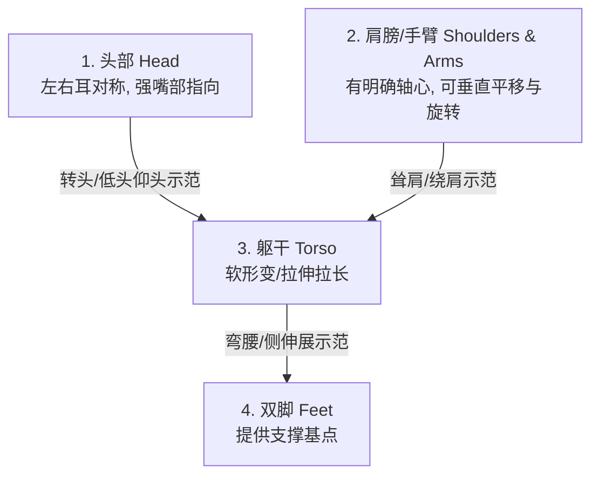

# nick Design System (Google Stitch Inspired)

> **设计基准版本**：v1.0.0-Stitch  
> **视觉哲学**：治愈系但不低龄 (Warm, Healing & Professional) — 温暖奶油底色 + 生命感薄荷绿，圆角与柔和阴影传达陪伴与关怀，宠物是绝对主角，UI 则退为精致的舞台背景。

---

## 1. Design Tokens (Stitch 语义化代币)

模仿 Google Stitch 设计系统，我们将设计代币（`Design Tokens`）分为“引用代币（Ref）”和“系统语义代币（Sys）”两层。代码与动效中一律使用 **Sys Tokens**。

### 1.1 Color Tokens

#### 引用代币 (Reference Colors)
```css
/* Mint Green (Brand) */
ref.color.mint-primary:        #2FBF98;
ref.color.mint-hover:          #27A583;
ref.color.mint-light:          #F2FBF7;

/* Neutral Warm Cream */
ref.color.cream-background:   #FAF6EF;
ref.color.cream-surface:      #F4F1EA;
ref.color.cream-border:       #EDE9E0;

/* Text & Inks */
ref.color.ink-primary:        #2F2A33; /* 主要文字与深色影子底 */
ref.color.ink-secondary:      #6B657A; /* 次要描述文字 */
ref.color.ink-disabled:       #B9B3C2; /* 锁定段位/禁用状态 */
```

#### 系统语义代币 (System Semantic Colors)
```css
sys.color.primary:             ref.color.mint-primary;
sys.color.primary-hover:       ref.color.mint-hover;
sys.color.on-primary:          #FFFFFF;

sys.color.background:          ref.color.cream-background;
sys.color.surface:             ref.color.cream-surface;
sys.color.surface-border:      ref.color.cream-border;

sys.color.text-primary:        ref.color.ink-primary;
sys.color.text-secondary:      ref.color.ink-secondary;
sys.color.text-disabled:       ref.color.ink-disabled;

/* 状态色 (Semantic States) */
sys.color.success:             ref.color.mint-primary;
sys.color.warning:             #FFC948; /* 阳光黄 (提醒/Gold 段位) */
sys.color.error:               #FF6B5E; /* 珊瑚红 */
sys.color.accent:              #FF8A70; /* 腮红橙 */
```

---

## 2. 🦿 拟人化宠物设计标准 (Anthropomorphic Mascot Guide)

为了确保电子宠物在跟练界面能为用户提供最直观的动作姿态参照，所有宠物资产（`nick`）的视觉表现必须具备**头、手（肩）、身体、脚**的分明肢体结构。



### 2.1 骨骼与关节参考标准 (Skeletal Standards)
在 `Rive` 编辑器中进行骨骼绑定（`Rigging`）时，必须设定以下 5 类核心骨骼节点，并为程序员暴露其几何坐标（用于与 Vision framework 提取出的骨骼点对齐）：

1.  **`bone_head`**：头部质心。必须对称地拥有两个高度明显的视觉标记点（如长耳狐兔的双耳、小草人的双叶草，小熊的双耳），用于在“侧颈拉伸（`side neck stretch`）”时表现清晰的倾斜角度（`Angle of Inclination`）。
2.  **`bone_left_shoulder` / `bone_right_shoulder`**：肩关节节点。必须能够独立地向上平移（示范 `shrug`）或沿圆形轨道旋转（示范 `shoulder roll`）。
3.  **`bone_left_hand` / `bone_right_hand`**：手腕/手端点。用于在伸展操中引导手臂上举或叉腰。
4.  **`bone_torso_spine`**：躯干脊椎中枢。用于在身体偏转或侧拉时产生弧形变（演示躯干弯曲度）。
5.  **`bone_base_anchor`**：脚部地面描点。保证在做任何伸展操时，宠物能稳固锚定在透明窗底边缘，不产生无谓 of 离地漂移。

---

## 3. 💎 动效分级与商业化特权 (Animation Tiers & Monetization)

宠物的动效不仅是交互表现，更是情绪价值收费的核心载体。动效设计必须遵守以下分级权益限制：

```
┌────────────────────────────────────────────────────────┐
│ [订阅特权] Platinum+ 段位与高阶宠物                       │
│ └─ 专属彩蛋动效 (如万圣节幽灵化)                        │
│ └─ 高难拉伸动作演示 (如绕肩流光特效)                     │
│ └─ 复杂互动 (鼠标挠痒痒、捏脸形变)                       │
├────────────────────────────────────────────────────────┤
│ [免费基础] Gold 段位及以下                               │
│ └─ 基础四阶疲劳渐变 (Idle ➔ Yawn ➔ Drowsy ➔ Sleep)      │
│ └─ 基础 6 个头颈动作跟练示范                            │
│ └─ 闲时逗趣 (如打呼噜、打哈欠)                           │
└────────────────────────────────────────────────────────┘
```

### 3.1 免费基础动效 (Tier 0: Core Experience)
*   **疲劳四阶可视化**：
    1.  *清醒 (Alert)*: 呼吸平缓，眼睛明亮，随机向用户招手。
    2.  *劳累 (Fatigued)*: 开始打哈欠 (Yawn)，耳朵或叶子微微耷拉。
    3.  *眯眼 (Drowsy)*: 站立不稳，眼睛眯成一条缝，身体轻微晃动。
    4.  *趴下 (Sleep)*: 趴在底座上进入沉睡，头顶冒出 `zZZ` 气泡。
*   **基础领操动作**：标准的低头、仰头、向左转、向右转、左侧拉伸、右侧拉伸的平滑示范。

### 3.2 订阅档高阶动效 (Tier 1: Emotional Premium)
订阅档专属宠物（或高阶 Platinum+ 宠物）在以下场景必须包含更丰富的动效，作为用户的情绪付费点：
*   **复杂肢体形变**：如小熊可以用肉乎乎的熊掌捂住脸害羞，小草人的树枝手可以变化成爱心形状。
*   **强化跟练特效**：演示绕肩或伸展时，其肩膀和手部动作在 `Rive` 中绑定粒子流光，使用户在跟练时获得“魔法光效反馈”。
*   **丰富的桌面互动**：
    *   *挠痒痒 (Tickle)*: 鼠标在宠物肚子区域滑动时，宠物做出缩起身体大笑的敏感形变。
    *   *拖动尖叫 (Drag)*: 拖动悬浮窗时，宠物露出惊恐并死死抓住屏幕边缘的动态拉长特效。
    *   *彩蛋动作 (Easter Eggs)*: 触发特定时间（如深夜 24 点、万圣节）时，宠物穿上幽灵装或做出梦游动画。

---

## 4. Layout & Components (Stitch 风格组件与网格)

基于 Stitch 的 4px 像素网格，确立 macOS 端的窗口与组件规范。

### 4.1 组件设计代币 (Component Tokens)

#### 按钮组件 (Button)
*   **`sys.component.btn-primary`**：
    *   尺寸：`height: 44px` / `border-radius: 14px (xl)` / `font: 15px bold`
    *   样式：`background: sys.color.primary` / `text: sys.color.on-primary`
*   **`sys.component.btn-secondary`**：
    *   尺寸：`height: 38px` / `border-radius: 10px (md)` / `font: 13px semibold`
    *   样式：`background: sys.color.surface` / `text: sys.color.text-secondary`

#### 交互卡片 (Card)
*   尺寸：`width: 400px` / `border-radius: 24px (xl)` / `padding: 28px`
*   样式：`background: #FFFFFF`，无外边框，使用系统大阴影（`shadow.xl: 0 20px 60px rgba(0,0,0,0.18)`）进行图层悬浮分层。

---

## 5. 🔒 隐私视觉语言 (Privacy Guard Language)

设计系统要求强制在任何激活摄像头的 UI 中使用以下视觉保障，让用户获得极强的隐私安全感：

1.  **指示器对齐**：当摄像头捕获开始时，跟练面板顶部正中必须常驻由 `sys.color.success` (薄荷绿) 高亮显示的 `🔒 Local inference — Camera stream never leaves your Mac` 文本标志，并且其前附带一把锁的 SF Symbol 图标。
2.  **绝对无真实画面**：UI 中禁止放置任何用于“对齐画面”的真实视频窗口。摄像头的使用完全是黑盒，仅在后台计算出骨骼位置，并直接映射为深色背景（`sys.color.text-primary`，即 #2F2A33）上的宠物影子或绿色火柴人虚线。这向用户传达了绝对的安全信号。
