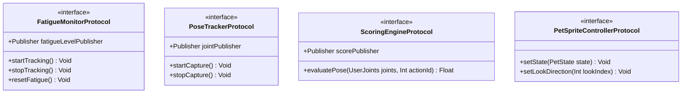

# v1.0.0 本地接口与精灵图状态机控制协议设计

> **技术方案**：[tech-solution.md](./tech-solution.md)  
> **数据持久化设计**：[db-design.md](./db-design.md)

本产品为 **macOS 纯端侧单机项目**，无任何与云端网络服务器的 HTTP API 交互。  
为了实现软件工程的松耦合，本接口设计定义为**应用内本地服务协议（Swift Protocols）**与**精灵图状态机控制接口（Sprite State Machine APIs）**。

---

## 1. 应用内服务协议 (Local Services Protocols)

项目核心业务通过 `Combine` 响应式框架进行状态广播与消费。主要协议定义如下：



### 1.1 疲劳追踪服务 (FatigueMonitorProtocol)
*   **用途**：检测系统的用户全局活动，向外分发当前的疲劳时间百分比。
*   **Swift 协议接口**：
    ```swift
    import Foundation
    import Combine

    protocol FatigueMonitorProtocol: ObservableObject {
        /// 疲劳进度流，发布当前的疲劳值 (0.0 到 1.0)
        var fatigueLevelPublisher: AnyPublisher<Double, Never> { get }
        
        /// 触发警报阈值流，当到达阈值时发布 Void
        var alertThresholdPublisher: AnyPublisher<Void, Never> { get }
        
        /// 启动全局活动监听
        func startTracking()
        
        /// 暂停全局活动监听 (如电脑休眠或手动置忙)
        func stopTracking()
        
        /// 重置疲劳计时 (如用户完成一次跟练)
        func resetFatigue()
    }
    ```

### 1.2 姿态追踪服务 (PoseTrackerProtocol)
*   **用途**：隔离 Vision 姿态检测，发布归一化的骨骼关节点数据。
*   **Swift 协议接口**：
    ```swift
    import Foundation
    import Combine
    import CoreGraphics

    struct UserJoints {
        var head: CGPoint          // 头部归一化坐标 (0.0 - 1.0)
        var leftShoulder: CGPoint  // 左肩
        var rightShoulder: CGPoint // 右肩
        var isConfidenceHigh: Bool // 识别置信度是否通过
    }

    protocol PoseTrackerProtocol: ObservableObject {
        /// 实时姿态数据发布流
        var jointPublisher: AnyPublisher<UserJoints?, Never> { get }
        
        /// 用户视频人像遮罩分割数据流 (用于影子面板渲染)
        var personMaskPublisher: AnyPublisher<CGImage?, Never> { get }
        
        /// 开启摄像头进行 Vision 帧推理
        func startCapture()
        
        /// 关闭摄像头，完全释放 Vision 推理队列与视频输入
        func stopCapture()
    }
    ```

### 1.3 动作跟练评分引擎 (ScoringEngineProtocol)
*   **用途**：消费姿态数据，计算与跟练动作的到位重合率。
*   **Swift 协议接口**：
    ```swift
    protocol ScoringEngineProtocol: ObservableObject {
        /// 当前动作对齐百分比发布流 (0.0 到 1.0)
        var alignmentScorePublisher: AnyPublisher<Double, Never> { get }
        
        /// 动作锁定期就位保持进度流 (0.0 到 1.0)
        var holdProgressPublisher: AnyPublisher<Double, Never> { get }
        
        /// 输入当前 Vision 检测的姿态，返回动作对齐拟合分
        func evaluatePose(_ joints: UserJoints, targetActionId: Int) -> Double
        
        /// 重置评分状态
        func resetEngine()
    }
    ```

---

## 2. 精灵图状态机控制接口 (Sprite State Machine APIs)

桌面端透明窗口的电子宠物由 **8×11 透明 WebP 精灵图集**（图集 `1536×2288`，单帧 `192×208`）驱动切帧动画（CHANGE-004）。程序通过状态机输入改变宠物的表现，状态机负责将输入映射为图集的目标行（Row）与帧序列播放策略。

状态机输入命名与规范如下：

| 状态机输入 (Input Name) | 数据类型 (Type) | 取值范围 (Range) | 作用与触发动画 |
|:---|:---|:---|:---|
| **`fatigue_level`** | Double | `0.0 - 1.0` | **疲劳值输入**：<br>- `0 - 0.49`：播放 Idle 待机呼吸行（Row 0）。<br>- `0.5 - 0.79`：切换至倦怠、打哈欠（Yawn）行。<br>- `0.8 - 1.0`：进入伏案睡觉行循环。 |
| **`is_workout_active`** | Bool | `true / false` | **跟练指示**：<br>- `true`：宠物切换至“精神抖擞领操模式”行（根据 `action_id` 表演伸展动作）。<br>- `false`：退回到普通桌面待机状态。 |
| **`action_id`** | Int | `0 - 5` | **动作编号**：<br>- 对照 `WorkoutSession` 的 6 个领操动作。随着 `action_id` 改变，宠物切换至不同部位拉伸示范的动画行。 |
| **`trigger_celebrate`** | 触发事件 | — | **触发跳舞庆祝**：<br>- 激活时切换至跳舞/大笑行播放一轮后自动回退待机（用于“挠痒痒成功”和“跟练动作得分通过”）。 |
| **`look_index`** | Int | `0 - 15` | **16 方向视线随动**：<br>- `0 - 7`：映射至 Row 9 第 `look_index` 帧。<br>- `8 - 15`：映射至 Row 10 第 `look_index - 8` 帧。<br>- 光标静止/离开盲区时回退 Row 0 待机。 |
| **`is_premium`** | Bool | `true / false` | **付费专属控制**：<br>- `true` 时解锁高阶宠物专属动效行（挠痒痒大笑、弹性拉伸等拟人化互动）。 |

### Swift 驱动示例：
```swift
// Map fatigue level to sprite state machine animation rows
func updateSpriteState(fatigue: Double) {
    switch fatigue {
    case ..<0.5: spriteController.setState(.idle)
    case ..<0.8: spriteController.setState(.yawn)
    default:     spriteController.setState(.sleep)
    }
}
```

---

## 3. 本地内购状态控制流 (StoreKit 2 Callbacks)

*   **支付触发接口**：  
    当用户拉起订阅时，本地调起 macOS App Store 购买流程。
*   **状态处理代理**：
    ```swift
    protocol SubscriptionManagerDelegate: AnyObject {
        /// 当订阅购买被 Apple 沙盒校验通过时回调
        func subscriptionDidUnlockPremium()
        
        /// 订阅被恢复购买或过期时回调
        func subscriptionStatusDidUpdate(isPremium: Bool)
    }
    ```
