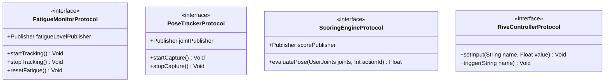

# v1.0.0 本地接口与 Rive 状态机控制协议设计

> **技术方案**：[tech-solution.md](./tech-solution.md)  
> **数据持久化设计**：[db-design.md](./db-design.md)

本产品为 **macOS 纯端侧单机项目**，无任何与云端网络服务器的 HTTP API 交互。  
为了实现软件工程的松耦合，本接口设计定义为**应用内本地服务协议（Swift Protocols）**与 **Rive 矢量状态机变量控制接口（Rive State Machine APIs）**。

---

## 1. 应用内服务协议 (Local Services Protocols)

项目核心业务通过 `Combine` 响应式框架进行状态广播与消费。主要协议定义如下：



### 1.1 疲劳追踪服务 (FatigueMonitorProtocol)
*   **用途**：检测系统的用户全局活动，向外分发当前的疲劳时间百分比。
*   **Swift 协议接口**：
    ```swift
    import Foundation
    import Combine

    protocol FatigueMonitorProtocol: ObservableObject {
        /// 疲劳进度流，发布当前的疲劳值 (0.0 到 1.0)
        var fatigueLevelPublisher: AnyPublisher<Double, Never> { get }
        
        /// 触发警报阈值流，当到达阈值时发布 Void
        var alertThresholdPublisher: AnyPublisher<Void, Never> { get }
        
        /// 启动全局活动监听
        func startTracking()
        
        /// 暂停全局活动监听 (如电脑休眠或手动置忙)
        func stopTracking()
        
        /// 重置疲劳计时 (如用户完成一次跟练)
        func resetFatigue()
    }
    ```

### 1.2 姿态追踪服务 (PoseTrackerProtocol)
*   **用途**：隔离 Vision 姿态检测，发布归一化的骨骼关节点数据。
*   **Swift 协议接口**：
    ```swift
    import Foundation
    import Combine
    import CoreGraphics

    struct UserJoints {
        var head: CGPoint          // 头部归一化坐标 (0.0 - 1.0)
        var leftShoulder: CGPoint  // 左肩
        var rightShoulder: CGPoint // 右肩
        var isConfidenceHigh: Bool // 识别置信度是否通过
    }

    protocol PoseTrackerProtocol: ObservableObject {
        /// 实时姿态数据发布流
        var jointPublisher: AnyPublisher<UserJoints?, Never> { get }
        
        /// 用户视频人像遮罩分割数据流 (用于影子面板渲染)
        var personMaskPublisher: AnyPublisher<CGImage?, Never> { get }
        
        /// 开启摄像头进行 Vision 帧推理
        func startCapture()
        
        /// 关闭摄像头，完全释放 Vision 推理队列与视频输入
        func stopCapture()
    }
    ```

### 1.3 动作跟练评分引擎 (ScoringEngineProtocol)
*   **用途**：消费姿态数据，计算与跟练动作的到位重合率。
*   **Swift 协议接口**：
    ```swift
    protocol ScoringEngineProtocol: ObservableObject {
        /// 当前动作对齐百分比发布流 (0.0 到 1.0)
        var alignmentScorePublisher: AnyPublisher<Double, Never> { get }
        
        /// 动作锁定期就位保持进度流 (0.0 到 1.0)
        var holdProgressPublisher: AnyPublisher<Double, Never> { get }
        
        /// 输入当前 Vision 检测的姿态，返回动作对齐拟合分
        func evaluatePose(_ joints: UserJoints, targetActionId: Int) -> Double
        
        /// 重置评分状态
        func resetEngine()
    }
    ```

---

## 2. Rive 矢量动画控制接口 (Rive Input APIs)

桌面端透明窗口的电子宠物为 Rive 骨骼动画（`.riv` 资产）。程序员需要通过控制 Rive 内部的变量（Inputs）来改变宠物的表现。

Rive 内部状态机变量命名与输入规范如下：

| 状态机变量名 (Input Name) | 数据类型 (Type) | 取值范围 (Range) | 变量作用与触发动画 |
|:---|:---|:---|:---|
| **`fatigue_level`** | Number | `0.0 - 100.0` | **疲劳值输入**：<br>- `0 - 50`：展示 Idle 待机、摇晃尾巴。<br>- `50 - 79`：转入倦怠、打哈欠（Yawn）。<br>- `80 - 100`：进入伏案睡觉状态。 |
| **`is_workout_active`** | Boolean | `true / false` | **跟练指示**：<br>- `true`：宠物转入“精神抖擞领操模式”（根据 `action_id` 表演伸展动作）。<br>- `false` : 退回到普通桌面待机状态。 |
| **`action_id`** | Number | `0.0 - 5.0` | **动作编号**：<br>- 对照 `WorkoutSession` 的 6 个领操动作。随着 `action_id` 改变，宠物做不同部位的拉伸示范。 |
| **`trigger_celebrate`** | Trigger | — | **触发跳舞庆祝**：<br>- 激活该触发器时，宠物会跳起大笑转圈（用于“挠痒痒成功”和“跟练动作得分通过”）。 |
| **`is_premium`** | Boolean | `true / false` | **付费专属控制**：<br>- `true` 时启用更高难度的拉伸细节动作，并允许触发领操时脚下的粒子光圈效果。 |

### Swift 驱动 Rive 示例：
```swift
// Swift 驱动 Rive 状态机输入示例
func updateRiveState(fatigue: Double) {
    if let stateMachine = self.riveViewModel.stateMachine {
        // 设置 Rive 疲劳输入值
        stateMachine.setInput("fatigue_level", value: fatigue * 100.0)
    }
}
```

---

## 3. 本地内购状态控制流 (StoreKit 2 Callbacks)

*   **支付触发接口**：  
    当用户拉起订阅时，本地调起 macOS App Store 购买流程。
*   **状态处理代理**：
    ```swift
    protocol SubscriptionManagerDelegate: AnyObject {
        /// 当订阅购买被 Apple 沙盒校验通过时回调
        func subscriptionDidUnlockPremium()
        
        /// 订阅被恢复购买或过期时回调
        func subscriptionStatusDidUpdate(isPremium: Bool)
    }
    ```
