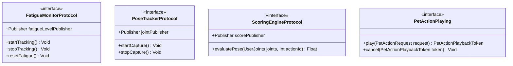

# v1.0.0 本地服务与宠物动画控制协议设计

> **技术方案**：[tech-solution.md](./tech-solution.md)  
> **数据持久化设计**：[db-design.md](./db-design.md)

本产品为 **macOS 纯端侧单机项目**，无任何与云端网络服务器的 HTTP API 交互。  
为了实现软件工程的松耦合，本接口设计定义为**应用内本地服务协议（Swift Protocols）**与**语义化宠物动作控制协议**。同一动作命令可由 RealityKit 3D 或桌面 sprite strip 实现，调用方不感知骨名、图集行号和具体帧数。

---

## 1. 应用内服务协议 (Local Services Protocols)

项目核心业务通过 `Combine` 响应式框架进行状态广播与消费。主要协议定义如下：


```mermaid
classDiagram
    class FatigueMonitorProtocol {
        <<interface>>
        +Publisher fatigueLevelPublisher
        +startTracking() Void
        +stopTracking() Void
        +resetFatigue() Void
    }
    class PoseTrackerProtocol {
        <<interface>>
        +Publisher jointPublisher
        +startCapture() Void
        +stopCapture() Void
    }
    class ScoringEngineProtocol {
        <<interface>>
        +Publisher scorePublisher
        +evaluatePose(UserJoints joints, Int actionId) Float
    }
    class PetActionPlaying {
        <<interface>>
        +play(PetActionRequest request) PetActionPlaybackToken
        +cancel(PetActionPlaybackToken token) Void
    }
```

### 1.1 疲劳追踪服务 (FatigueMonitorProtocol)
*   **用途**：检测系统的用户全局活动，向外分发当前的疲劳时间百分比。
*   **Swift 协议接口**：
    ```swift
    import Foundation
    import Combine

    protocol FatigueMonitorProtocol: ObservableObject {
        /// 疲劳进度流，发布当前的疲劳值 (0.0 到 1.0)
        var fatigueLevelPublisher: AnyPublisher<Double, Never> { get }
        
        /// 触发警报阈值流，当到达阈值时发布 Void
        var alertThresholdPublisher: AnyPublisher<Void, Never> { get }
        
        /// 启动全局活动监听
        func startTracking()
        
        /// 暂停全局活动监听 (如电脑休眠或手动置忙)
        func stopTracking()
        
        /// 重置疲劳计时 (如用户完成一次跟练)
        func resetFatigue()
    }
    ```

### 1.2 姿态追踪服务 (PoseTrackerProtocol)
*   **用途**：隔离 Vision 姿态检测，发布归一化的骨骼关节点数据。
*   **Swift 协议接口**：
    ```swift
    import Foundation
    import Combine
    import CoreGraphics

    struct UserJoints {
        var head: CGPoint          // 头部归一化坐标 (0.0 - 1.0)
        var leftShoulder: CGPoint  // 左肩
        var rightShoulder: CGPoint // 右肩
        var isConfidenceHigh: Bool // 识别置信度是否通过
    }

    protocol PoseTrackerProtocol: ObservableObject {
        /// 实时姿态数据发布流
        var jointPublisher: AnyPublisher<UserJoints?, Never> { get }
        
        /// 用户视频人像遮罩分割数据流 (用于影子面板渲染)
        var personMaskPublisher: AnyPublisher<CGImage?, Never> { get }
        
        /// 开启摄像头进行 Vision 帧推理
        func startCapture()
        
        /// 关闭摄像头，完全释放 Vision 推理队列与视频输入
        func stopCapture()
    }
    ```

### 1.3 动作跟练评分引擎 (ScoringEngineProtocol)
*   **用途**：消费姿态数据，计算与跟练动作的到位重合率。
*   **Swift 协议接口**：
    ```swift
    protocol ScoringEngineProtocol: ObservableObject {
        /// 当前动作对齐百分比发布流 (0.0 到 1.0)
        var alignmentScorePublisher: AnyPublisher<Double, Never> { get }
        
        /// 动作锁定期就位保持进度流 (0.0 到 1.0)
        var holdProgressPublisher: AnyPublisher<Double, Never> { get }
        
        /// 输入当前 Vision 检测的姿态，返回动作对齐拟合分
        func evaluatePose(_ joints: UserJoints, targetActionId: Int) -> Double
        
        /// 重置评分状态
        func resetEngine()
    }
    ```

---

## 2. 宠物动作控制接口 (Pet Animation APIs)

### 2.1 语义动作标识

动作标识使用可扩展字符串值，而不是固定 Swift `enum`。首批保留 ID：

- `idle-neutral`
- `idle-breathe`
- `idle-wave-goodbye`
- `idle-look-around`
- `idle-stretch-bounce`
- `yawn`
- `sleep`
- `celebrate`
- `tickle`
- `coach-tilt-left` / `coach-tilt-right`
- `coach-turn-left` / `coach-turn-right`
- `coach-look-down` / `coach-look-up`
- `look-direction`

命名使用小写 kebab-case，表达用户可理解的动作语义，不包含骨名、方向轴、资源格式或图集行号。已发布 ID 不得改义；需要不兼容调整时新增 ID。

### 2.2 播放请求

```swift
struct PetActionID: RawRepresentable, Hashable, Codable, Sendable {
    let rawValue: String
}

struct PetActionRequest: Hashable, Sendable {
    let requestID: UUID
    let actionID: PetActionID
    let priority: PetActionPriority
    let playbackMode: PetActionPlaybackMode
    let parameters: [String: Float]
}

@MainActor
protocol PetActionPlaying: AnyObject {
    /// 请求播放语义动作。资源缺失、rig 不兼容或 manifest 非法时抛出明确错误。
    /// 返回的 token 用于幂等取消同一次请求；实现必须按 manifest 的中断窗口退出。
    func play(_ request: PetActionRequest) throws -> PetActionPlaybackToken

    /// 取消指定播放请求。重复取消同一 token 不产生副作用。
    func cancel(_ token: PetActionPlaybackToken)
}
```

大厅/跟练的 `PetAnimationGraph` 和桌面的 `PetSpriteEngine` 都实现 `PetActionPlaying`。调用方只发送动作意图：

| 领域输入 | 动作解析 |
|---------|---------|
| `fatigueLevel < 0.5` | `idle-neutral` / 调度 `idle-breathe` 等低优先级动作 |
| `0.5 <= fatigueLevel < 0.8` | `yawn` |
| `fatigueLevel >= 0.8` | `sleep` |
| 当前跟练动作 | 对应 `coach-*` 动作 ID |
| 得分通过或打卡完成 | `celebrate` |
| 光标方向 | `look-direction` + `directionIndex: 0...15` |

高优先级动作可以请求打断低优先级动作，但实际切换点由当前 clip manifest 的 `interruptWindows` 决定。Reduce Motion 开启时，播放器解析 `reducedMotionClipId`，调用方不分叉动作逻辑。

### 2.3 资源 manifest

每个 3D clip 与桌面 strip 使用同一 `clipId`，由角色发布 manifest 关联：

```json
{
  "schemaVersion": 1,
  "characterId": "sprout",
  "rigVersion": 2,
  "skeletonContractHash": "sha256:...",
  "clips": {
    "idle-wave-goodbye": {
      "durationSeconds": 2.4,
      "sampleRate": 30,
      "loopMode": "once",
      "blendInSeconds": 0.16,
      "blendOutSeconds": 0.20,
      "interruptWindows": [[0.0, 0.18], [2.10, 2.40]],
      "reducedMotionClipId": "idle-breathe",
      "sprite": {
        "resource": "sprout_rig2_idle-wave-goodbye.webp",
        "frameCount": 72,
        "framePixelWidth": 384,
        "framePixelHeight": 416,
        "logicalWidth": 192,
        "logicalHeight": 208
      }
    }
  }
}
```

加载器必须验证 schema、rig version、合同哈希、时长、帧数、资源哈希和所有时间区间。验证失败时回退已批准的 `idle-neutral` 或迁移期正式资产，不得静默播放不兼容 clip。

### 2.4 3D 动画图

`PetAnimationGraph` 按 Base → Action → Additive → IK → Secondary → Corrective 固定顺序求值，并一次性返回完整关节姿势。任何 planner、solver 或 view 都不得绕过动画图直接写 RealityKit `jointTransforms`。

运行时需要暴露可测试的纯逻辑入口：

```swift
@MainActor
protocol PetAnimationGraphEvaluating: AnyObject {
    /// 在指定单调时刻计算完整角色姿势；不会直接访问场景、文件系统或 UI。
    func evaluate(at time: TimeInterval) throws -> PetEvaluatedPose
}
```

`PetEvaluatedPose` 包含有序关节变换、可选 blend shape 权重和本帧事件。Blender USD 往返已验证 shape 可保留，但 App 最低支持 macOS 14、直接 shape API 要求 macOS 15，因此该字段在 v1.0.0 始终是可选输出；身体完整性和核心动作不得依赖它。

---

## 3. 本地内购状态控制流 (StoreKit 2 Callbacks)

*   **支付触发接口**：  
    当用户拉起订阅时，本地调起 macOS App Store 购买流程。
*   **状态处理代理**：
    ```swift
    protocol SubscriptionManagerDelegate: AnyObject {
        /// 当订阅购买被 Apple 沙盒校验通过时回调
        func subscriptionDidUnlockPremium()
        
        /// 订阅被恢复购买或过期时回调
        func subscriptionStatusDidUpdate(isPremium: Bool)
    }
    ```
