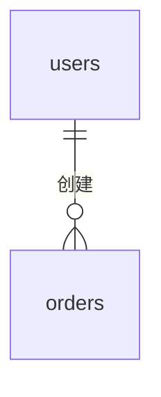

# v1.0.0 数据库设计

> 本文档只记录 v1.0.0 新增或修改的表结构
> 产品完整数据模型见 [engineering/docs/db-schema/full-schema.md](../../../engineering/docs/db-schema/full-schema.md)（基线，发布后须合入）
> 技术方案见 [tech-solution.md](./tech-solution.md)
> 接口设计见 [api-design.md](./api-design.md)

---

## 变更清单

| 表名 | 变更类型 | 执行顺序 | 说明 |
|------|---------|---------|------|
| <!-- 表名 --> | 新增/修改 | 1 | <!-- 说明 --> |

---

## 规范约定

| 约定项 | 规范 |
|--------|------|
| 表命名 | 小写 snake_case，复数形式（如 `users`、`verification_codes`）|
| 字段命名 | 小写 snake_case（如 `created_at`、`phone_number`）|
| 主键 | `id BIGINT UNSIGNED AUTO_INCREMENT` |
| 标准时间字段 | `created_at DATETIME(3)`、`updated_at DATETIME(3)` 所有表必须包含 |
| 软删除 | 支持软删除的表增加 `deleted_at DATETIME(3) NULL` |
| 字符集 | `utf8mb4` |
| 排序规则 | `utf8mb4_unicode_ci` |
| 存储引擎 | `InnoDB` |
| 金额字段 | 使用 `BIGINT`，存储最小货币单位（分）|
| 枚举字段 | 使用 `VARCHAR` 存储枚举字符串，不使用 `ENUM` 类型 |
| 注释 | 每张表和每个字段必须有注释 |
| 索引命名 | 唯一索引：`uk_{表名缩写}_{字段名}`；普通索引：`idx_{表名缩写}_{字段名}` |
| 外键约束 | **不使用数据库外键约束**，关联关系通过应用层代码保证 |
| NULL 使用规则 | 有意义的可选字段允许 NULL；有默认值的字段用 NOT NULL + DEFAULT；业务上必填的字段用 NOT NULL |
| API/DB 命名映射 | DB 层使用 snake_case（`created_at`），API 层映射为 lowerCamelCase（`createTime`），后端代码负责转换 |

---

## 表设计详情

---

### `{表名}`（新增/修改）

**用途**：<!-- 这张表存什么数据，用于什么业务场景 -->

<!-- 修改类型时填写「当前状态（修改前）」-->
<!-- 新增类型时删除此节 -->

**当前状态（修改前）**：

| 字段名 | 类型 | 可为空 | 当前状态 |
|--------|------|--------|---------|
| id | BIGINT UNSIGNED | 否 | 已存在 |

**变更后字段**：

| 字段名 | 类型 | 可为空 | 默认值 | 说明 |
|--------|------|--------|--------|------|
| id | BIGINT UNSIGNED | 否 | AUTO_INCREMENT | 主键 |
| <!-- 字段名 --> | <!-- 类型 --> | 否/是 | <!-- --> | <!-- 说明 --> |
| created_at | DATETIME(3) | 否 | CURRENT_TIMESTAMP(3) | 创建时间 |
| updated_at | DATETIME(3) | 否 | CURRENT_TIMESTAMP(3) ON UPDATE CURRENT_TIMESTAMP(3) | 更新时间 |

**状态字段转换规则**（如有 status 字段）：

| 当前状态 | 转换条件 | 目标状态 | 说明 |
|---------|---------|---------|------|
| <!-- PENDING --> | <!-- 条件 --> | <!-- USED --> | <!-- --> |

**索引设计**：

| 索引名 | 类型 | 字段 | 用途 |
|--------|------|------|------|
| <!-- `uk_{缩写}_{字段}` --> | UNIQUE | <!-- 字段名 --> | <!-- 用途 --> |

**增量 DDL（执行此 SQL 完成变更）**：
```sql
-- 新增表示例
CREATE TABLE `{表名}` (
  `id` BIGINT UNSIGNED NOT NULL AUTO_INCREMENT COMMENT '主键',
  -- 其他字段
  `created_at` DATETIME(3) NOT NULL DEFAULT CURRENT_TIMESTAMP(3) COMMENT '创建时间',
  `updated_at` DATETIME(3) NOT NULL DEFAULT CURRENT_TIMESTAMP(3) ON UPDATE CURRENT_TIMESTAMP(3) COMMENT '更新时间',
  PRIMARY KEY (`id`)
) ENGINE=InnoDB DEFAULT CHARSET=utf8mb4 COLLATE=utf8mb4_unicode_ci COMMENT='{表注释}';
```

**回滚 DDL**：
```sql
DROP TABLE IF EXISTS `{表名}`;
-- 或修改表的回滚：ALTER TABLE ... DROP COLUMN ...
```

**迁移安全性**：
<!-- 说明此 DDL 是否可在线执行（不锁表），评估表大小和执行时长
- 新增可为空字段：通常可在线执行，不锁表
- 新增唯一索引：执行前须验证现有数据无重复值
- 修改字段类型：可能锁表，需评估表大小
-->

**数据迁移**：
<!-- 是否需要迁移存量数据，无则填「无需数据迁移」 -->

**数据清理策略**（如适用）：
<!-- 对于时效性数据（如验证码），说明清理策略
- 是否属于本版本交付物：是/否
- 清理 SQL：DELETE FROM {表名} WHERE ... LIMIT 1000
- 使用 LIMIT 分批删除，避免大事务锁表
如本版本需开发清理任务，应在 requirements.md 中登记为功能模块
-->

---

## 实体关系

<!-- 本版本涉及的表之间的逻辑关系



> ER 图展示逻辑关联关系，非物理外键约束（本项目规范：不在数据库层使用外键）
-->

---

## 说明

- 本文档为版本内数据库设计稿，增量 DDL 同步至版本 README.md 发布关键项
- 回滚 DDL 在发布失败时使用，须在执行增量 DDL 前确认回滚方案可行
- 迁移安全性说明供 DBA 审核，生产环境执行前需评估表大小和执行时长
- **多 DDL 执行顺序**：本版本有多条 DDL 时，按「变更清单」表格中的顺序依次执行
- 字段命名使用 snake_case（DB 层），API 层映射为 lowerCamelCase
- 本文档变更通过 CHANGES.md 统一追踪 → 见 [CHANGES.md](../CHANGES.md)
