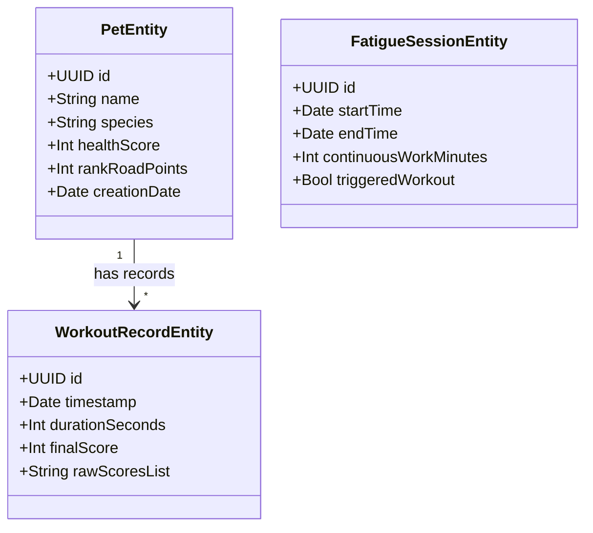

# v1.0.0 本地持久化实体设计 (SwiftData)

> **技术方案**：[tech-solution.md](./tech-solution.md)  
> **数据持久化框架**：`SwiftData` (由 macOS App Sandboxed 独立沙盒内的 `SQLite` 驱动)

---

## 1. 规范约定

针对 SwiftData，我们约定以下持久化规范：
1.  **实体命名**：采用 Swift PascalCase，并以 `Entity` 结尾（例如 `PetEntity`、`WorkoutRecordEntity`）。
2.  **主键定义**：使用 UUID 作为本地物理唯一标识符，加上 `@Attribute(.unique)` 确保排他性。
3.  **可选字段**：对于业务上可能为空的属性使用 Swift Optional 类型（`?`）。
4.  **关联关系**：不使用底层的 cascade 物理外键约束，而是通过 SwiftData 的 `@Relationship` 装饰器进行内存对象图编排，并指定删除级联规则。
5.  **数据迁移**：当未来版本发生 Schema 变更时，采用 `VersionedSchema` 配合 `SchemaMigrationPlan` 进行轻量迁移（Lightweight Migration）。

---

## 2. 实体设计详情



### 2.1 宠物实体 (PetEntity)
*   **用途**：存储本地当前养成的电子宠物属性与状态。
*   **Swift 类声明**：
    ```swift
    import Foundation
    import SwiftData

    @Model
    final class PetEntity {
        @Attribute(.unique) var id: UUID
        var name: String                  // 宠物昵称，如 "Minty"
        var species: String               // 宠物种类编码: "sprout" (小草) | "bear" (熊) | "fox" (狐兔)
        var healthScore: Int              // 健康养成总值，范围 0-1000 映射段位
        var rankRoadPoints: Int           // 段位历程积分
        var creationDate: Date            // 选定宠物的时间
        
        @Relationship(deleteRule: .cascade) 
        var workoutRecords: [WorkoutRecordEntity] = [] // 关联做操记录

        init(name: String, species: String, healthScore: Int = 100) {
            self.id = UUID()
            self.name = name
            self.species = species
            self.healthScore = healthScore
            self.rankRoadPoints = healthScore
            self.creationDate = Date()
        }
    }
    ```

### 2.2 运动跟练记录实体 (WorkoutRecordEntity)
*   **用途**：记录每次用户完成的颈椎拉伸跟练详情与 Vision 评分。
*   **Swift 类声明**：
    ```swift
    import Foundation
    import SwiftData

    @Model
    final class WorkoutRecordEntity {
        @Attribute(.unique) var id: UUID
        var timestamp: Date               // 训练完成时间戳
        var durationSeconds: Int          // 训练持续总秒数
        var finalScore: Int               // 本次训练总得分 (0 - 100)
        var actionScores: String          // 6类动作各自分数，以 CSV 格式存储 "90,95,85,100,75,90"
        
        var pet: PetEntity?               // 关联的宠物

        init(durationSeconds: Int, finalScore: Int, actionScores: String) {
            self.id = UUID()
            self.timestamp = Date()
            self.durationSeconds = durationSeconds
            self.finalScore = finalScore
            self.actionScores = actionScores
        }
    }
    ```

### 2.3 疲劳监测会话实体 (FatigueSessionEntity)
*   **用途**：记录历史疲劳时长发生以及是否有效被掐断（做操）。
*   **Swift 类声明**：
    ```swift
    import Foundation
    import SwiftData

    @Model
    final class FatigueSessionEntity {
        @Attribute(.unique) var id: UUID
        var startTime: Date               // 该段连续工作的开始计时时间
        var endTime: Date                 // 计时结束时间 (用户离开或开始做操)
        var continuousWorkMinutes: Int    // 连续键鼠活动时长 (分钟)
        var triggeredWorkout: Bool        // 本次疲劳提醒是否成功引导用户做操

        init(startTime: Date, endTime: Date, continuousWorkMinutes: Int, triggeredWorkout: Bool) {
            self.id = UUID()
            self.startTime = startTime
            self.endTime = endTime
            self.continuousWorkMinutes = continuousWorkMinutes
            self.triggeredWorkout = triggeredWorkout
        }
    }
    ```

---

## 3. 初始种子数据 (Seed Data)

当用户首次通过 Onboarding 初始化 App 并创建 ModelContainer 时，需要往 SwiftData 数据库插入初始的默认值：
```swift
// SwiftData 种子数据注入示例
let container = try ModelContainer(for: PetEntity.self)
let context = container.mainContext

// 检查是否存在当前宠物
let fetchDescriptor = FetchDescriptor<PetEntity>()
let pets = try context.fetch(fetchDescriptor)

if pets.isEmpty {
    // 创建默认的初始小草人 "Minty"
    let defaultPet = PetEntity(name: "Minty", species: "sprout", healthScore: 100)
    context.insert(defaultPet)
    try context.save()
}
```

---

## 4. 迁移与回退策略

1.  **数据迁移计划 (MigrationPlan)**：
    由于是在沙盒内，v1.0.0 发行后，下一版本若新增可选字段，SwiftData 会通过 Lightweight 自动分析并升级 SQLite，开发人员无需书写 SQL。
2.  **强制重构/物理清空**：
    在开发与测试（BETA）期间，如果表结构发生非向下兼容冲突，可以直接在 Xcode 中清理 Build 资产，或通过系统应用设置清除沙盒 Container，以重置 SQLite 本地缓存数据。
