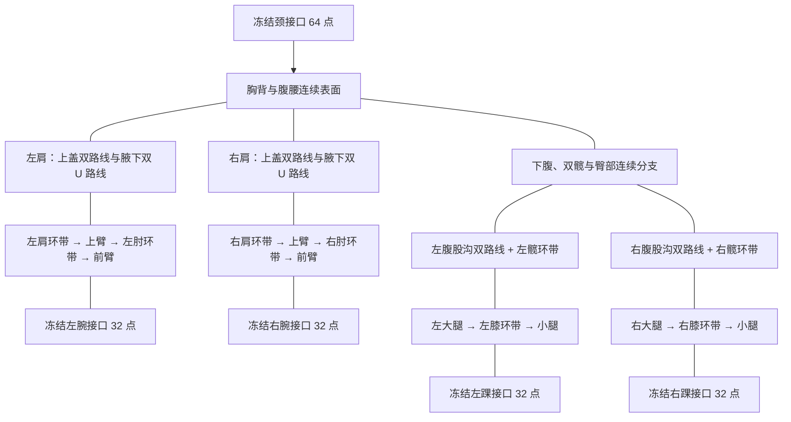

# Sprout 完整重建：生产路径决策与 DCC 制作工单

> CHANGE-065，2026-09-14，负责人 @winston（AI 执行）。
> **决策已完成：停止当前自动修补投入，选择完整 DCC 面流制作作为后续方向；当前不具备新施工开工条件。**
> 本文交付制作范围、布局要求、来源、迁移顺序和能力判断。它不是已完成的顶点/面连接设计，也不授予新试修额度。
> 模型未改善；B1、纯权重路线及更早关闭路线保持冻结。正式生产合同、身份和资源不变。

## 1. 结论及依据

应把下一项实物交付改为一份完整的无骨架身体网格，覆盖双肩、双肘、双髋、双膝及肩腋/髋裆过渡。
继续在 Tripo 左侧残余错误上做独立补丁，即使局部改善，也还需要全身拓扑、正式身份、32 关节权重和动作重做；
目前没有证据支持把这部分追加投入当作通往生产的短路径。

**当前 AI 自动施工不启动。** 我已经证明能做局部编辑、保存资产、运行审计和定位失败，
但还没有提供一套覆盖上述分支、满足几何约束且可实际嵌入小草体型的完整连接与点位设计。
这正是 B1 没有完成的工作；换成“完整重建”这个名称不会补上能力缺口。

因此选择的是 **DCC 直接制作 + 独立验收** 的生产方式，执行者需要具备并展示这项建模能力。
实际资源建议是引入能直接制作角色拓扑的 DCC 协作，我继续负责合同、审计、骨架/运行时接入；
本次未寻找、联络或购买任何服务。若后续 AI 能给出实际完整布局，也可作为执行者，
但当前不能承诺由我独立完成，更不能把未验证的自动构造排成确定工期。
这属于当前执行能力判断，不是“模型无解”或“只能由人完成”的证明。

| 可选方向 | 现有证据 | 本次决定 |
|---|---|---|
| 继续纯权重、改求解器或重采样 | R1 已关闭；K6 未消除真实保护失败 | 不继续 |
| B1 固定点位换边/配对 | 四关节合格环均为 0；新增折面、自交和裆部角痕 | 不继续 |
| 自动生成环躯干、分支管、cell/domain，最后贴回身份 | CHANGE-018/019/020/023 已关闭相应方法；新 hash 不代表新方法 | 不换名重做 |
| 再运行 licensed v001/R0 builder | v001 静态失败，R0 披露的网格/三骨/线性权重组合动态失败 | 不重放、不修补旧输出 |
| 直接设计完整身体面流，逐点制作分支及关节带 | 方法目标未被 B1 验证；当前缺少实际完整布局和可确认的执行能力 | 选作生产方向，未准予开工 |

## 2. 来源与保留边界

正式造型仍以 Rig v2 §2.1 的小草身份为准。Tripo 当前 41 骨腰部 GLB 是 vendor trial 的有效加工源，
不是新的正式身份批准；本决策不改变其历史身份或把失败 B1 提升为加工源。

| 输入 | 角色与处理方式 |
|---|---|
| 正式身份 GLB，SHA `d8bfa4d395a97c13839188d9c5d7f2212ae3c6e346262f874eee985f38deca36` | 唯一整体轮廓、面部、手足、叶冠和色彩依据；旧 24 骨、bind、权重与动作不复制 |
| 已批准 Blender Studio 原始 basemesh，SHA `189b794efea10fcad23350b56ce22109a6247afda8f08df67b3e6e22018c4b70` | 新直接适配路线的拟议拓扑种子；来源清单、归因和 source approval 沿用原绑定。来源获批不等于新路线获批，更不等于源网格适合小草 |
| Tripo CHANGE-033 腰部 GLB，SHA `43e1ab242ba8f55b83faa498fdea691448412bdca69d9dc13eff86bf138145a7` | 已有失败姿态和腰部观感参考；不直接映射为正式身份、32 骨权重或生产动作 |
| CHANGE-020 原始报告中的五接口 | 只读取其独立 canonical 点序、坐标和哈希；失败 body connectivity 不复用 |
| 旧冻结头、手足及叶冠证据 | 只按现行闭合身份装配流程使用；冻结 patch 中有 `finalTopologyReusable=false` 的对象不能当现成合格闭合组件 |
| B1 Blend、九边界及完整来源记录 | 失败证据，全部只读；不把九条施工边界当作生产五接口，也不沿它们重开 B1 |

采用上述 licensed 来源是为了与现行 `licensed_basemesh_adapted` 来源合同一致，
并不表示获批原源、v001 或 R0 网格已通过生产认证。新直接适配必须有新的具体路线决策、范围、执行者、
预算和不同的实际操作记录；**本文不复活 CHANGE-026**。如实际改成完全从零生成或 Tripo 衍生，
必须如实更改来源方案并解决合同兼容，不能仍填写 licensed provenance。

新施工应一次声明整个身体可编辑面域及冻结身份部件；该范围是拟议变更，尚未应用。
关节与分支内可以新增、删除或重新放置点，不固定到 Tripo 随机三角网的 40,000 个点位。
五个正式边界保持准确点序/坐标；脸、手指脚趾、叶轮廓和非重建区不为迎合连接而拉扯。
不能用“完整身体”作为任意重塑身份部件或放宽几何门槛的许可。

## 3. 身体布局与施工顺序

下面是**解剖布线工单图**，覆盖必须连接的部位，尚不是可交给 builder 的完整 face list。
一个图框不代表已经构造了合格补片；实际共享边、极点位置和空间坐标仍须由建模执行者提供。

### 3.1 先设计肩腋和髋裆分支

先在身份参考和原源上标出前胸、肩峰、后肩胛、腋底、前下腹、内侧腿根及臀部的解剖导向线，
圈定关节核心、真实一圈净空、支撑路线邻域和稳定表面。先确定这些分支如何占用胸背/骨盆表面，
再连接长段肢体；不先造一圈水平腰口或圆柱，最后挤出剩余空间接腿。

| 过渡区 | 必须实际制作的布线 | 禁止留下的缺口 |
|---|---|---|
| 每侧腋下 | 前胸 → 腋底 → 后背的两条顶点不相交 U 路线，路线间为连续四边条带；路线及真实一圈无极点 | 腋底扇形汇聚、跨腋长对角线、用封口片连接壳层 |
| 每侧肩上盖 | 前肩/胸上部 → 肩峰上方 → 后肩胛的两条不相交路线，条带与上臂环带及胸背共享真实边 | 把所有路线都放在腋下；以一条近路重复声明两次 |
| 每侧髋裆 | 前下腹 → 内侧腿根 → 臀部的两条不相交路线，形成四边鞍形过渡；保留双腿分叉间距 | 用一圈低位腰切口硬连双腿；中线单点辐射；内部交叉面 |
| 胸背、腹腰及臀外侧 | 接收环数/密度转换，必要极点安排在已标出的稳定表面 | 极点落进关节核心、真实一圈或支撑路线及其一圈；只凭面中心距离判“在外” |

路线与关节环相遇时，共享同一网格中的点和边，不能叠加两张补片冒充连通。
两条支撑路线的 vertex-disjoint 要求适用于同一支撑族，不是要求支撑线与所有环永不相交。
实际分支连接设计必须列出面、边及邻接，证明相交处仍为合法四边面且核心价数为 4。

### 3.2 再制作八个关节环带

每处至少四个真实闭环是合同底线。设计起点采用六环以留出压缩/伸展分布空间，
这只是建模建议，不是新增硬门槛或已验证的最佳环数。
肘/膝至少两环位于转轴两侧，轴位于两条环之间；肩/髋的完整环放在肢体侧，
分支侧由上一节支撑条带接入，不能假设肩腋或髋裆是一根圆柱。

环的点数须按实际周长、曲率和纵向间距选定；本轮没有这些完整量测，不编造统一的 16/24/32 点方案。
选定后同一关节各环点数固定且一一连接，四个象限的语义对应保持一致。
若以 `R[k,i]` 表示第 k 环第 i 点，基本四边连接为
`(R[k,i], R[k,i+1], R[k+1,i+1], R[k+1,i])`，环内 i 循环；
这只定义环带邻接，不能解决肩腋/髋裆分支或保证三维几何。

纵向间距依据局部周向边长布置，避免内弯侧挤成一条折线、外弯侧仅剩长面。
点位由导向线和明确局部体块控制，逐带直接制作并检查轮廓；
不能把最终 shrinkwrap、nearest projection、全局 relax 或随机换边当作点位设计。
密度增减只能在环带、支撑路线及各自真实一圈外完成；固定腕踝 32 点接口不要求所有关节也为 32 点。

先制作一侧明确布局，再镜像其拓扑设计并核对两侧冻结接口。
镜像不能覆盖略有不对称的冻结边界；在非关节过渡区吸收差异并记录理由。
左右同名关节环数差 ≤1、环点数中位差 ≤10%，仍采用现行合同。

### 3.3 五接口及静态预检

将已设计的长段肢体和胸腹稳定面连接到五个准确接口，密度转换区放在关节/路线净空外。
提交前从真实网格重新生成全量 semantic declaration，包含八关节、三类支撑族的左右六组和所有实际环/路线 ID。
不得从设计标签或空数组生成通过声明。

正式开放身体必须单组件、Euler -3、边界点数 `[32,32,32,32,64]`，全四边面，
且无自交、折面、非流形、退化/重复面。环间 connector alignment ≥0.85、面比例 ≤3.5，
关节核心及真实一圈无极点；完整环与支撑判据均沿用合同。最小面角 10° 仍仅为诊断值。
完成这些并通过全部 S0 门禁才可进入闭合身份阶段，不能拿一份全四边报告先绑骨。

## 4. 身份、坐标与 UV 的施工要求

生产坐标为 +Z 向上、正面 -Y、角色左侧 +X，发布高度 1.10 m，物体变换应用为单位变换。
Tripo 源采用不同朝向与量纲；其诊断距离不换称毫米，也不通过简单改轴就继承正式骨位或接口。

正式身份形体在布局时用于只读观察和避免明显比例错误。通过 S0 后才进行显式 identity fitting、
冻结部件装配和闭合身份审核；身份装配改变过的几何仍需重新查自交/面流，不能沿用装配前的通过数值。
八方位应有整体和身体单独掩码、材质图及线框图，按现行 Rig v2 的身份底线和原尺寸观感审查。
脸、掌指、脚趾、叶冠单独审查，不通过排除身体区域遮蔽漂移。

新拓扑 UV 不从无关的 vendor UV 或 licensed 人体材质整体复制。保留冻结身份部件的原面角 UV，
重建区按身体/肢体建立可检查的局部 UV 岛，低拉伸且低可见区域放接缝；
主要弯曲区、支撑带和可见色彩边界不跨 seam。跨新旧连接逐面记录来源/局部对应并检查方向及色彩连续。
不能把全局最近面传递当最终方案。Tripo 当前纯色无内嵌贴图不代表生产小草没有纹理迁移工作。

## 5. 41 骨试验到 32 关节生产的迁移

正式骨架只在 S0、闭合身份、原图和精确用户身份审批之后制作。
当前 closed-identity 专用 assessor 尚未实现，它也是进入 Rig Gate 0 前必须补齐的工具交付，
不允许用旧 open-five CLI 的 `--approval` 参数或报告内 `approved=true` 代替。

| 已有内容 | 可以保留 | 生产中必须重做 |
|---|---|---|
| native 41 骨与冻结 rest | 动作目标、局部缺陷位置及运动范围参考 | 在新身体体积中重新确定 32 骨中心、轴、roll、父子层级与 inverse bind |
| 多级 vendor twist 链 | 扭转分布的视觉参考 | 正式上臂/前臂/大腿 twist 为并行分支，不能成为肘、腕、膝的父级；不直接合并旧矩阵 |
| 旧腰部及其他权重 | 哪种观感已被接受、何处不能退化 | 新顶点支持集合与逐区权重；每点 ≤4 影响、非负、和为 1±1e-5、Root 零权重；导出按合同裁掉小于 0.005 后归一化并复验 |
| vendor 五动作 | 运动节奏与目标姿势参考；15°/60°/转身/跳跃是重点回归场景 | 控制 rig 到 32 骨重新适配/烘焙，逐帧验收；旧面 ID 不能用于新网格接触统计 |
| 冠叶 | 外观和随动参考 | `DEF_CrownRoot`、左右叶独立控制；旧 41 骨缺失的语义不能靠骨名替换补出 |
| 已有审计器、姿态收集与碰撞工具 | 经验证的通用部分 | 新拓扑 semantic mask、接触对、面流声明及实际骨架输出重新绑定，不复制历史“通过”字段 |

生产骨名/顺序/层级完整清单直接引用 [Rig v2 §5](./pet-character-rig-v2.md)，不在此维护第二份合同。
动作保持 30 fps、Root 原地、可中断窗口；macOS 14 身体完整性不得依赖 macOS 15 的运行时 morph。
发布继续 Blender USD → USDZ → RealityKit；桌面图集由同一获批 DCC 动作源输出。

## 6. 交付顺序、责任与停止点

| 阶段 | 执行职责 | 可验收实物 | 未通过时 |
|---|---|---|---|
| 开工条件 | DCC 建模执行者；@winston/AI 复核 | 全身实际布局、八关节点数及环序、全部分支连接、极点与点位策略、准确编辑域、执行预算 | 当前缺失，不启动施工；不继续追加同类诊断 |
| 开放身体制作 | DCC 建模执行者 | 一份无骨架 Blend、完整 declaration、源/合同哈希及全量 S0 报告 | 保留失败实物，按事前新路线预算结算；无额度则停止，不能重置编号 |
| 闭合静态身份 | DCC 制作；AI 审计；用户审核身份 | 闭合 Blend、纹理、八方位原图与身体指标、绑定真实文件哈希的独立审批 | 返回静态制作，不创建骨架；审批不覆盖机器失败 |
| Rig Gate 0/1 | DCC 绑定；AI 骨架/权重与实际姿态审计 | 32 关节结构/单位变换、语义权重及单关节全范围实际几何 | 拒绝该交付；不能只测试三骨临时权重后宣称整条来源不可用 |
| Gate 2/3 | DCC 绑定；AI 轴向与组合姿态检查 | 全部 32 关节局部轴压力矩阵，以及 Rig v2 §8.4 全部组合姿势的八方位原图 | 不接入正式 App；具体返修按该阶段预算，不滚动增轮 |
| Gate 4 | DCC 动作；AI 逐帧审查 | 每条候选动作 30 fps 每帧八方位原图，包括表情、冠叶、接触与连续性；Tripo 五动作只作附加回归参考 | 任一帧失败，动作退回 DCC；不能只查五个旧动作或首中末帧 |
| 格式往返与切换 | AI/App；用户审批正式资源 | Rig v2 §10 交换/发布矩阵、USDZ/RealityKit 实际往返、macOS 14、独立桌面 strip、可回滚 manifest | 保持正式资源，不以 Blender 成功替代运行时验收 |

当前没有已确认的 DCC 执行者、完整布局或可依据的工期，因此不填写“再给 2/4/6 小时必能完成”。
新路线开工时必须一次写明从制作到审查的总工时、可用修订数和最终失败处理；
内部 WIP 修订可在已批准范围/预算内完成，不为每一次改点重复要求审批。
旧结构路线累计计费 123 分钟、剩余 297 分钟已关闭；不向新路线结转。

**下一项实质工作是由具备直接建模能力的执行者完成上述开工布局并制作静态网格。**
不再安排“再做一个分析工具/再换一次配对目标”作为模型进度。
若没有这样的执行能力或资源，就应明确保持角色生产阻塞；不能通过持续写下一份计划营造前进。
我可继续承担来源管理、机器检查、原图审核及生产接入，但不会将这些能力等同于已证明的完整角色建模能力。

## 7. 本次核查及工具入口

本次只新增决策文档及只读核验记录，没有启动 Blender、网格构造、权重求解或动作生成。
原 licensed Blend 位于 `/tmp/nick-base-mesh-audit.zy2uSL/` 的临时文件已不存在；在 App/项目、
nick 私有目录、Downloads 和 `/private/tmp` 按已知文件名搜索未找到副本。
从原 manifest 的官方 artifact URL 恢复时返回 HTTP 403，未恢复源文件；不把网络失败解释为许可证失效。
未来使用这条来源前还须恢复**同 hash 的原件**并重新执行 intake 文件核验，不能从失败候选反推原件。
私有核验记录位于 `~/Library/Application Support/nick/production-route-decision-20260914/`。
本轮结果是“选定方向、识别开工缺口”，不是新模型、静态通过或已完成的生产施工图。

保全复核通过：原 2,004 份冻结输入、四份用户文件、B1 四十份私有证据及十三份已提交代码逐一 hash 不变。
App HEAD 仍为 `9548d2aaa4594f2986273458f1e1a8008fd987dd`，无 tracked 改动，4,725 个旧 untracked 路径清单保持。
五接口 raw report、机器合同均与各自冻结哈希一致，真实接口中心也确认 left 在 +X；没有编辑旧交接包来掩盖说明差异。
核验报告：[input-verification.json](</Users/zhoutong/Library/Application Support/nick/production-route-decision-20260914/input-verification.json>)，
SHA `1f2ddf110eed662051c1413f3f081f2ee3bb51c1ec18ecc12a8023ebd1a0acc8`。

| 当前入口（App 路径相对 macos-app） | 用法/限制 |
|---|---|
| `character_pipeline/sprout/v2/contract/sprout-rig-v2-static-topology-contract-v2.json` | SHA `4cc50d3c1f31b34d3347835995379d5e6c38bd7a84fa49077b3bcc08f5247377`；本轮与 Skill 副本逐字节相等 |
| `character_pipeline/sprout/v2/handoff/static-topology-contract-v2/` | 当前 profiles、审计命令及接口合同入口；其中 R0 历史额度已用完，不能据此重开 |
| `character_pipeline/sprout/v2/work/experiments/v009-licensed-basemesh-adapted-v001/source-intake.json` | 只读来源入口；原批准、license、归因、audit 绑定保留，旧 builder/candidate 不复用 |
| `character_pipeline/sprout/v2/reports/retopology-v008-no-seam-body-proxy-v001-report.json` | 只读 canonical interfaces；SHA `b91698ef881632b52d7d90287096862bea1dd24eec8e190e0509a7fd4a84bf67`；不是合格身体 |
| `tools/pet-model/audit_meshy_dcc_topology.py` | 现行真实环、条带、极点、几何和静态状态审计；正式声明必须完整 |
| `tools/pet-model/render_rig_v2_retopology_review.py`、`measure_rig_v2_identity_silhouette.py` | 原尺寸多视图与身份量测；不能把截图或 mask 数值代替全部门禁 |
| `character_pipeline/sprout/v2/handoff/manual-dcc-v001/` | 旧包只读。其“直接闭合/旧 gateZeroPassed”流程及 right +X 说明不能覆盖当前分阶段合同和 left +X；不能直接发送旧 zip 作为现行工单 |

Blender 官方说明中，Poly Build 是交互式添加、删除和移动几何的工具集合，
不是自动生成合格角色面流的能力证明：[Poly Build（4.1 官方手册）](https://docs.blender.org/manual/en/4.1/modeling/meshes/tools/poly_build.html)。
本机生产仍锁定 Blender 4.3.2；查询工具功能不代表升级版本或执行建模。

历史证据见 [B1 结果 §9–10](./pet-knee-structure-review.md)、[路线总账](./pet-knee-route-review.md)
及 [Rig v2](./pet-character-rig-v2.md)。本文不修改架构或基础设施选型，不新增 ADR，也不改变生产验收阈值。
